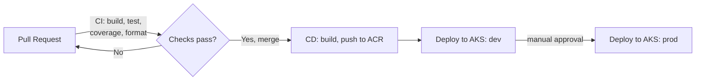

# AdjacentPairCounter

A small .NET 10 Web API that counts consecutive, non-overlapping duplicate characters in a string — built as the reference application for a complete, production-shaped CI/CD platform on Azure and Kubernetes.

If you're here for the API itself, it's a clean-architecture solution under [`src/`](src/): `Api`, `Application`, `Domain`, and `Tests` projects. If you're here for the CI/CD setup, this README walks through exactly how it was built, in order, so you can replicate the same pattern in your own project — regardless of what the application actually does.

For the reasoning behind each decision, see [docs/HLD.md](docs/HLD.md) (the big picture). For exact resource names, roles, and configuration values, see [docs/LLD.md](docs/LLD.md) (the detailed reference). This README is the "do it yourself, in order" guide.

## Live environments

| Environment | URL | Notes |
|---|---|---|
| Dev | `http://apc-dev.172.168.206.73.nip.io` | Auto-deployed on every merge to `main` |
| Prod | `http://apc-prod.172.168.206.73.nip.io` | Deployed only after manual approval |

Try it:
```bash
curl http://apc-dev.172.168.206.73.nip.io/healthz
curl -X POST http://apc-dev.172.168.206.73.nip.io/api/adjacentpairs/count \
  -H "Content-Type: application/json" -d '{"input":"aabbbcc"}'
```
Interactive API docs (Scalar) are available at `/scalar` on both environments.

## Architecture, in one picture



One GitHub repository, one Azure resource group, one AKS cluster hosting two isolated namespaces (`dev` and `prod`). No long-lived secrets anywhere — every system authenticates using short-lived, federated tokens. Full detail in [docs/HLD.md](docs/HLD.md).

---

## How this was built — a step-by-step, reusable guide

Everything below is written so you can follow it for **your own application**, not just this one. Wherever a name is specific to this project (e.g. `rg-apc-learn`), swap in your own naming convention — the pattern is what matters.

### Prerequisites

- An Azure subscription (a Free Trial works to start, but see the [troubleshooting](#troubleshooting) section — you may need to upgrade to Pay-As-You-Go to get past capacity restrictions on certain VM/node sizes)
- A GitHub repository for your code
- Locally installed: [Azure CLI](https://learn.microsoft.com/cli/azure/install-azure-cli), `kubectl` (installable via `az aks install-cli`), Docker, and your application's own SDK/runtime

### Phase 1 — Repository structure and branching strategy

Use **trunk-based development**, not GitFlow: one long-lived `main` branch, short-lived feature branches (`feature/...`, `fix/...`), every change merges via a reviewed pull request. GitFlow's extra long-lived branches (`develop`, `release/*`) solve a problem — maintaining multiple shipped versions in parallel — that a continuously-deployed service doesn't have.

Set up branch protection on `main` (**Settings → Branches → Add branch protection rule**):
- Require a pull request before merging
- **Skip "require approvals" if you're a solo maintainer** — GitHub won't let you approve your own PR, so this setting alone would lock you out of merging
- Require conversation resolution before merging
- "Do not allow bypassing the above settings" — applies the rule to you too, not just other contributors
- Block force pushes and branch deletion
- You'll come back here after Phase 2 to add "require status checks," once your CI workflow has run at least once (GitHub can't require a check name it's never seen)

### Phase 2 — CI pipeline (runs on every pull request)

Before writing the workflow, pin your build tool's version so CI, your machine, and the eventual Docker build all use the identical version — for .NET, that's a `global.json`:
```json
{ "sdk": { "version": "10.0.302", "rollForward": "latestPatch" } }
```

Write a multi-stage `Dockerfile` (build stage with the full SDK, runtime stage with just the runtime — smaller image, smaller attack surface) and a matching `.dockerignore`.

Then add `.github/workflows/ci.yml`, triggered on `pull_request` targeting `main`, with (at minimum) two jobs:
1. **Build/test/quality**: restore → build → format/lint check → test with coverage → publish artifacts
2. **Docker validate**: build the image (don't push it — CI never has push credentials)

See [this repo's `ci.yml`](.github/workflows/ci.yml) for the full working example, and [LLD.md §5](docs/LLD.md#5-ci-workflow-githubworkflowsciyml) for a breakdown of every step.

Once this workflow has run once (open any PR to trigger it), go back to branch protection and check **"Require status checks to pass"**, selecting the job names that appeared.

### Phase 3 — Azure foundation

Create one resource group for everything — this is what makes teardown a single command later:
```bash
az group create --name <rg-name> --location <region>
```

Create a Container Registry with admin login **disabled** (you'll authenticate properly via identity, not a shared static password):
```bash
az acr create --resource-group <rg-name> --name <acr-name> --sku Basic --admin-enabled false
```

### Phase 4 — Let GitHub Actions authenticate to Azure, without secrets

This is the piece that removes every long-lived credential from the picture. Create an Azure AD App Registration:
```bash
az ad app create --display-name "<your-app-name>"
az ad sp create --id <app-id>
```

Add a **federated credential** trusting GitHub's OIDC issuer for your exact repo and branch:
```bash
az ad app federated-credential create --id <app-id> --parameters '{
  "name": "gh-main-branch",
  "issuer": "https://token.actions.githubusercontent.com",
  "subject": "repo:<owner>/<repo>:ref:refs/heads/main",
  "audiences": ["api://AzureADTokenExchange"]
}'
```

> **Watch out**: modern GitHub Actions may issue OIDC tokens using an "immutable ID" subject format (`owner@ownerId/repo@repoId`) instead of the plain format above, and jobs with an `environment:` key get a *different* subject again (`...:environment:<name>`). If `azure/login` fails with `AADSTS700213: No matching federated identity record found`, the error message tells you the exact subject it received — copy that verbatim into your federated credential rather than guessing. See [LLD.md §3.1](docs/LLD.md#31-federated-credentials-on-gh-apc-cd) for the full explanation.

Grant this identity the least privilege it needs — for pushing images, that's `AcrPush` scoped to just the registry, nothing broader:
```bash
az role assignment create --assignee <app-id> --role AcrPush --scope <acr-resource-id>
```

In your GitHub repo, add these as **repository variables** (Settings → Secrets and variables → Actions → Variables) — they're identifiers, not secrets:
`AZURE_CLIENT_ID`, `AZURE_TENANT_ID`, `AZURE_SUBSCRIPTION_ID`, `ACR_LOGIN_SERVER`.

### Phase 5 — Compute: create the AKS cluster

```bash
az aks create \
  --resource-group <rg-name> \
  --name <aks-name> \
  --node-count 1 \
  --node-vm-size <size> \
  --enable-managed-identity \
  --attach-acr <acr-name> \
  --generate-ssh-keys \
  --enable-oidc-issuer \
  --enable-workload-identity
```
`--attach-acr` automatically grants the cluster's own identity `AcrPull` on your registry — no manual role assignment needed for image pulls. `--enable-oidc-issuer` and `--enable-workload-identity` cost nothing to enable now and unlock pod-level Azure authentication (e.g. for Key Vault) later, without a cluster rebuild.

Grant your GitHub Actions identity from Phase 4 access to fetch cluster credentials:
```bash
az role assignment create --assignee <app-id> --role "Azure Kubernetes Service Cluster Admin Role" --scope <aks-resource-id>
```

Connect and verify:
```bash
az aks get-credentials --resource-group <rg-name> --name <aks-name>
kubectl get nodes
```

### Phase 6 — Kubernetes manifests

Create manifests under a `k8s/` folder in your repo (not applied ad-hoc — reviewed via PR like everything else):

1. **Namespaces** — one per environment (`dev`, `prod`), isolating them logically within the one cluster
2. **ConfigMap** — environment-specific configuration (e.g. `ASPNETCORE_ENVIRONMENT`), separate from the image
3. **Deployment** — your container image, replica count, **resource requests/limits** (so one pod can't starve its neighbors), and **readiness/liveness probes** against a health endpoint
4. **Service** (`ClusterIP`) — a stable internal address in front of your pods
5. **HorizontalPodAutoscaler** — min/max replicas, target CPU utilization
6. **Ingress** — needs a controller first:
   ```bash
   kubectl apply -f https://raw.githubusercontent.com/kubernetes/ingress-nginx/controller-v1.15.1/deploy/static/provider/cloud/deploy.yaml
   ```
   Then an `Ingress` resource per namespace routing by hostname to that namespace's Service.

Apply everything, verify it's healthy, *then* commit it — see [this repo's `k8s/` folder](k8s/) for the complete working example.

### Phase 7 — CD pipeline (runs on every merge to `main`)

Add `.github/workflows/cd.yml`, triggered on `push` to `main`:

1. **Build, test, push** — rebuild and retest independently of CI (never trust a PR build — other changes may have merged since), then log in via OIDC and push a uniquely tagged image (e.g. `<run-number>-<short-sha>`) to your registry
2. **Deploy to dev** — fetch AKS credentials, `kubectl set image` to roll out the new tag, `kubectl rollout status` to block until healthy (or fail), `kubectl rollout undo` on failure
3. **Deploy to prod** — identical, but gated by a GitHub Environment

To make the prod gate real: **Settings → Environments → New environment**, name it `production`, check **"Required reviewers"** and add yourself, and **uncheck "Allow administrators to bypass"** (otherwise, as the repo owner, the gate wouldn't actually apply to you). Reference `environment: production` on that job in your workflow — and remember it needs its **own federated credential** (see the callout in Phase 4), since its OIDC subject differs from the plain branch-based one.

See [this repo's `cd.yml`](.github/workflows/cd.yml) for the full working example.

### Phase 8 — Verify end to end

Open a PR, watch CI run and gate the merge. Merge it, watch CD deploy to dev automatically, then pause on "Review deployments" for prod. Approve it, confirm the rollout completes, and hit your actual endpoints to confirm the real application responds — not just a health check.

---

## Troubleshooting

Real problems hit while building this, and their fixes — see [LLD.md §10](docs/LLD.md#10-troubleshooting-reference-real-issues-hit-while-building-this) for the full table. The short version:

- **VM/node creation fails with `SkuNotAvailable`/capacity errors everywhere you try** → likely a Free Trial subscription restriction, possibly combined with requesting a deprecated VM SKU family. Upgrading to Pay-As-You-Go and/or requesting a quota increase for a current-generation SKU family (not the one that's already failing) usually resolves it.
- **`AADSTS700213: No matching federated identity record found`** → your federated credential's subject doesn't match what GitHub actually sent. Read the exact subject out of the error and match it precisely.
- **SSH-based deploy step times out** → GitHub-hosted runners use a huge, unallowlistable IP range. If your deploy target restricts SSH by IP, either allow a self-hosted runner on that target instead, or (as this project ultimately did) deploy to Kubernetes rather than a bare VM over SSH.

## Resource footprint and cost

Everything lives in a single Azure resource group, deletable in one command:
```bash
az group delete --name <rg-name> --yes
```
See [LLD.md §2](docs/LLD.md#2-resource-inventory) for the exact resource list, sizes, and regions used in this project.

## Roadmap

Not yet built, in priority order: **Azure Key Vault** for real application secrets (the cluster's workload identity is already enabled for this), **Application Insights + Log Analytics + Azure Monitor** for real observability beyond `kubectl logs`, and a genuine **high-availability / disaster-recovery** story (multi-node, multi-zone). See [docs/HLD.md §10](docs/HLD.md#10-where-this-goes-next) for detail.
