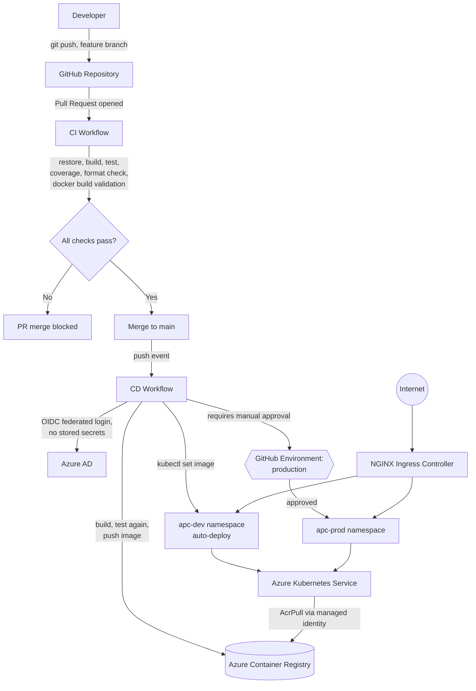

# High-Level Design (HLD)
### CI/CD Platform for AdjacentPairCounter on Azure

## 1. Purpose of this document

This document explains **what** was built and **why**, at the level a new engineer, a reviewer, or a manager should be able to read in ten minutes and understand the shape of the system. It intentionally avoids exact commands and field-by-field configuration — that detail lives in [LLD.md](LLD.md). If you're looking for copy-pasteable setup steps, see the main [README.md](../README.md) instead. This document is about the *decisions*, not the *keystrokes*.

## 2. The problem this solves

`AdjacentPairCounter` is a small .NET Web API. On its own, a working API isn't useful to anyone until it's reachable, and it isn't trustworthy until every change to it has been automatically verified before it reaches users. The goal of this project was to take the API from "code on a laptop" to "a system that tests itself, deploys itself, and recovers itself" — without a human manually running `docker build` or SSH-ing into a server whenever something needs to ship.

Concretely, this means: every proposed change is automatically built and tested before a human even reviews it; once approved and merged, it is automatically packaged, deployed, and verified; and if something goes wrong, the system reverts itself rather than leaving broken code running.

## 3. Goals and non-goals

**Goals:**
- Automated build, test, and code-quality gating on every pull request
- Automated, zero-touch deployment on every merge to the main branch
- A realistic dev/prod separation, with production protected by human approval
- No long-lived credentials stored anywhere in GitHub — every system authenticates using short-lived, purpose-scoped tokens
- Self-healing deployments: failed rollouts automatically roll back
- A cost-conscious footprint suitable for a learning/personal project, while using patterns that scale to real production use

**Explicit non-goals (for now):**
- High availability across multiple regions or availability zones
- A managed database (the API is currently stateless)
- Centralized secret storage via Key Vault (planned, not yet built)
- Deep observability via Application Insights / Log Analytics (planned, not yet built)

Calling these out matters as much as the goals — a design that quietly tries to do everything at once usually does nothing well. This system is deliberately scoped.

## 4. Architecture at a glance

## 5. Major components

| Component | Role |
|---|---|
| **GitHub Repository** | Single source of truth for application code, infrastructure manifests, and pipeline definitions. Trunk-based: one long-lived `main` branch, short-lived feature branches, everything merges via reviewed pull request. |
| **CI Workflow** | Runs on every pull request targeting `main`. Independently rebuilds the solution, runs all tests with coverage, checks code formatting, and validates that a Docker image builds. Nothing merges until every check passes. |
| **CD Workflow** | Runs on every merge to `main`. Rebuilds and retests from scratch (never trusts a prior CI run), pushes a versioned image to the registry, then rolls it out to Kubernetes — dev automatically, production only after a human clicks approve. |
| **Azure Container Registry (ACR)** | Private registry holding built container images. Nothing outside GitHub Actions and the cluster itself can push to or pull from it. |
| **Azure Kubernetes Service (AKS)** | Runs the application. A single cluster hosts two isolated namespaces (`apc-dev`, `apc-prod`) rather than two separate clusters, trading some isolation for lower cost — an explicit, deliberate trade-off. |
| **NGINX Ingress Controller** | The one public entry point into the cluster. Routes incoming HTTP traffic to the correct namespace based on hostname. |
| **Azure AD App Registration + Federated Credentials** | Lets GitHub Actions authenticate to Azure without any password, API key, or client secret ever existing. Explained further in §7. |
| **Azure VM** (historical) | An earlier, simpler deployment target used to learn container hosting fundamentals before moving to Kubernetes. Superseded by AKS; retained only as a teaching artifact and safe to decommission. |

## 6. Environment strategy

Two environments, `dev` and `prod`, are implemented as **Kubernetes namespaces within one cluster**, not as separate clusters. This is a cost decision: one cluster's control plane is free on AKS, and the marginal cost of a second full cluster (its own node pool, its own baseline compute) isn't justified for a project at this scale. The trade-off, stated plainly: namespace isolation is logical, not physical — a severe node-level failure or resource contention issue could theoretically affect both environments simultaneously. A team with production-grade availability requirements would give `prod` its own node pool or its own cluster. That's a real cost/isolation trade-off, not an oversight.

Promotion between environments is deliberate, not automatic: a build must succeed in `dev` before `prod` is even offered for approval, and `prod` additionally requires a named human reviewer to click "approve" in GitHub before anything changes there.

## 7. Security model

Three ideas run through every credential decision in this system:

1. **Nothing is a stored, long-lived secret if it can instead be a short-lived, federated token.** GitHub Actions authenticates to Azure using OpenID Connect (OIDC): GitHub issues a short-lived identity token scoped to a specific repository, branch, or environment; Azure AD trusts that token because of a pre-registered "federated credential" — there is no password or client secret sitting in a GitHub secret that could leak. The same idea applies inside the cluster: pods and nodes authenticate to Azure using **managed identity**, not embedded credentials.

2. **Every identity gets the least privilege it needs, scoped as narrowly as possible.** The identity that pushes images to the registry can only push (`AcrPush`), scoped to that one registry — not the whole subscription. The identity that deploys to Kubernetes can manage that one cluster — not arbitrary Azure resources.

3. **Isolation is explicit, not assumed.** Branch protection prevents any change reaching `main` without passing CI. Production additionally requires a human. Where a design choice trades isolation for cost (like the shared cluster in §6), that trade-off is written down, not hidden.

## 8. What happens end-to-end, in plain language

A developer finishes a change on a feature branch and opens a pull request. GitHub automatically builds the solution, runs every test, checks code formatting, and confirms a container image can be built — all before anyone reviews the code. If any of that fails, the PR simply cannot be merged; there is no override. Once it's green and reviewed, merging to `main` kicks off deployment: the system rebuilds the code one more time (deliberately not trusting the PR's build, in case other changes landed in between), pushes a uniquely tagged image to the registry, and rolls it out to the `dev` namespace in the Kubernetes cluster automatically. If the new version doesn't become healthy within a timeout, Kubernetes' own rollback mechanism reverts it — no custom scripting required. Only after `dev` succeeds does the pipeline offer to deploy to `prod`, and it waits there until a specific person explicitly approves it.

## 9. Known trade-offs (stated honestly)

- **Single-node AKS cluster.** Enough to demonstrate real rolling updates and autoscaling behavior, not enough to be genuinely highly available. A production system would run multiple nodes across availability zones.
- **Shared node pool for dev and prod.** Cost-efficient, but not the isolation a regulated or high-stakes production system would require.
- **No database yet.** The API is currently stateless, so there's no Key Vault-backed secret or persistent volume in play yet. The architecture (workload identity already enabled on the cluster) is ready for this the moment it's needed.
- **No deep observability yet.** Health can be checked; historical metrics, traces, and centralized logs (Application Insights, Log Analytics, Azure Monitor) are a deliberate next phase, not yet built.

## 10. Where this goes next

The natural next additions, in priority order, are: Azure Key Vault for real secrets (backed by the workload identity already configured), Application Insights and Log Analytics for actual observability instead of ad-hoc `kubectl logs`, and a genuine disaster-recovery story (multi-node, multi-zone, backup/restore strategy). None of these block the system from working today — they extend it.
