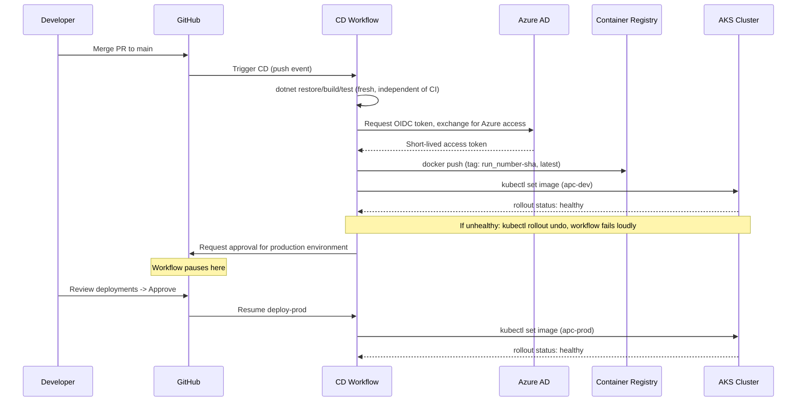

# Low-Level Design (LLD)
### CI/CD Platform for AdjacentPairCounter on Azure

This document is the detailed reference: exact resource names, exact roles, exact workflow behavior. Read [HLD.md](HLD.md) first if you want the "why" before the "what." Read the [README.md](../README.md) if you want to build this yourself, step by step, in your own project.

## 1. Naming convention

Resources follow Microsoft's Cloud Adoption Framework (CAF) abbreviation style: `<resource-type-prefix>-<workload>-<qualifier>`. This isn't cosmetic — a consistent prefix means anyone reading a resource name in the Azure Portal instantly knows its type without opening it.

| Resource | Name | Prefix meaning |
|---|---|---|
| Resource Group | `rg-apc-learn` | `rg-` |
| Virtual Network | `vnet-apc` | `vnet-` |
| Subnet | `snet-apc-vm` | `snet-` |
| Network Security Group | `nsg-apc-vm` | `nsg-` |
| Virtual Machine (historical) | `vm-apc-host` | `vm-` |
| Container Registry | `acrapcmlsryg` | `acr` (no hyphens — ACR names must be alphanumeric only) |
| AKS Cluster | `aks-apc` | `aks-` |
| App slug used throughout | `apc` | short for AdjacentPairCounter |

## 2. Resource inventory

| Resource | Region | SKU / size | Purpose |
|---|---|---|---|
| `rg-apc-learn` | East US 2 | — | Single resource group holding everything; deleting it tears down the entire environment in one command |
| `acrapcmlsryg` | East US 2 | Basic | Private Docker registry. Admin login **disabled** — no static credentials, ever |
| `vnet-apc` / `snet-apc-vm` | Central US | `10.10.0.0/16` / `10.10.1.0/24` | Networking for the historical VM phase |
| `nsg-apc-vm` | Central US | — | Firewall for the VM: SSH restricted to a single known IP, app port open |
| `vm-apc-host` | Central US | `Standard_B2s_v2` | Historical deployment target — superseded by AKS, safe to decommission |
| `aks-apc` | Central US | 1 node, `Standard_B2s_v2` | Runs the application via Kubernetes |

**Why Central US instead of East US 2 for compute**: East US 2 hit `SkuNotAvailable` capacity restrictions for every VM size tested, on this specific subscription, at the time of building this. Central US had available capacity for the same SKU family. This is a live-capacity issue, not a hard regional rule — check current availability with `az vm list-skus` before assuming a region will work. See the README's troubleshooting section for the full story, including a Free Trial → Pay-As-You-Go subscription upgrade and a quota increase that were both required to unblock this.

## 3. Identity and access control matrix

| Identity | Type | Granted role | Scope | Used for |
|---|---|---|---|---|
| `gh-apc-cd` (App Registration) | Azure AD App + federated credentials | `AcrPush` | `acrapcmlsryg` (registry only) | GitHub Actions pushing built images |
| `gh-apc-cd` (same app) | — | `Azure Kubernetes Service Cluster Admin Role` | `aks-apc` (cluster only) | GitHub Actions fetching AKS credentials to run `kubectl` |
| AKS cluster identity (system-assigned, via `--attach-acr`) | Managed Identity | `AcrPull` | `acrapcmlsryg` | Nodes pulling images at runtime — no stored registry credentials on any node |
| `vm-apc-host` identity (historical) | System-assigned Managed Identity | `AcrPull` | `acrapcmlsryg` | VM pulling images during the pre-AKS phase |

### 3.1 Federated credentials on `gh-apc-cd`

GitHub's OIDC token has a different **subject** claim depending on how the workflow job is configured, and Azure AD only trusts a federated credential whose subject matches *exactly*. This project needed three separate federated credentials on the same app registration:

| Federated credential name | Subject | Matches |
|---|---|---|
| `gh-apc-main-branch` | `repo:<owner>@<ownerId>/<repo>@<repoId>:ref:refs/heads/main` | Jobs with no `environment:` key (e.g. the build/push job) |
| `gh-apc-env-dev` | `repo:<owner>@<ownerId>/<repo>@<repoId>:environment:dev` | Jobs with `environment: dev` |
| `gh-apc-env-production` | `repo:<owner>@<ownerId>/<repo>@<repoId>:environment:production` | Jobs with `environment: production` |

**Note on the subject format**: modern GitHub Actions issues OIDC subjects using an "immutable ID" format (`owner@ownerId/repo@repoId`) rather than the plain `owner/repo` format shown in most older tutorials. If `azure/login` fails with `AADSTS700213: No matching federated identity record found`, the fix is always the same: read the exact subject string out of the error message and create (or update) a federated credential to match it precisely — don't guess the format.

## 4. GitHub repository configuration

### 4.1 Branch protection (on `main`)

| Setting | Value |
|---|---|
| Require a pull request before merging | Yes |
| Require approvals | **No** — see note below |
| Require status checks to pass | Yes — `Build, Test, Coverage, Format` and `Docker Build` |
| Require branches to be up to date before merging | Yes |
| Require conversation resolution | Yes |
| Do not allow bypassing (applies to admins too) | Yes |
| Allow force pushes | No |
| Allow deletions | No |

**Why "Require approvals" is off**: GitHub does not allow a PR author to approve their own pull request. On a single-maintainer repository, enabling this setting would make merging impossible without adding a second collaborator. Turn it on the moment a second person joins the project.

### 4.2 Repository variables (Settings → Secrets and variables → Actions → Variables)

These are identifiers, not credentials — safe to be visible in logs, so they're variables, not secrets.

| Variable | Value |
|---|---|
| `AZURE_CLIENT_ID` | App registration's client ID |
| `AZURE_TENANT_ID` | Azure AD tenant ID |
| `AZURE_SUBSCRIPTION_ID` | Azure subscription ID |
| `ACR_LOGIN_SERVER` | `acrapcmlsryg.azurecr.io` |
| `VM_HOST` / `VM_USER` | Historical — used only during the VM deployment phase |

### 4.3 Repository secrets

| Secret | Notes |
|---|---|
| `VM_SSH_PRIVATE_KEY` | Historical. Used only while deploying to the VM. No secret is required for the AKS deployment path — it authenticates entirely via OIDC, which is the whole point. |

### 4.4 GitHub Environments

| Environment | Protection rule |
|---|---|
| `dev` | None — deploys automatically |
| `production` | **Required reviewers**: at least one named person must approve. **"Allow administrators to bypass" is deliberately unchecked** — even the repository owner has to click approve, so the gate is real rather than decorative. |

## 5. CI workflow (`.github/workflows/ci.yml`)

Trigger: `pull_request` targeting `main`.

| Job | Steps | Purpose |
|---|---|---|
| `build-test` | checkout → setup .NET (reads `global.json`) → `dotnet restore` → `dotnet build` → `dotnet format --verify-no-changes` → `dotnet test` with coverage collection → publish coverage summary as a PR comment → `dotnet publish` → upload test results and publish output as workflow artifacts | Verifies the code is correct, tests pass, style conforms, and generates the artifacts a human might want to inspect |
| `docker-build` (needs `build-test`) | checkout → compute a tag from `run_number` + short SHA → Buildx setup → build the image (`push: false`) | Confirms the Dockerfile actually produces a working image, without ever pushing an unreviewed image anywhere |

`global.json` pins the .NET SDK version (`rollForward: latestPatch`) so the exact same SDK version is used locally, in CI, and in the Docker build — floating only for patch-level security updates, never a feature or major version jump without deliberate action.

## 6. CD workflow (`.github/workflows/cd.yml`)

Trigger: `push` to `main` (i.e., every merge).

| Job | Depends on | What it does |
|---|---|---|
| `build-test-push` | — | Rebuilds and retests **independently of CI** (never trusts a PR-branch build — guarantees the deployed artifact matches the exact commit on `main`). Logs into Azure via OIDC, logs into ACR, builds and pushes the image tagged both `<run_number>-<short-sha>` and `latest` |
| `deploy-dev` | `build-test-push` | OIDC login → fetch AKS admin credentials → `kubectl set image` on `apc-api` in `apc-dev` → `kubectl rollout status` (blocks until healthy or times out) → on failure, `kubectl rollout undo` |
| `deploy-prod` | `build-test-push`, `deploy-dev` | Identical to `deploy-dev`, targeting `apc-prod` — but gated by the `production` GitHub Environment's required-reviewer rule, so it pauses for a human before doing anything |

Kubernetes' own rolling-update and rollback mechanics (`kubectl rollout status` / `kubectl rollout undo`) replace what, in the earlier VM-based phase, was a hand-written bash script doing manual container swap, polling, and rollback. That script still exists in git history (see the VM section below) purely as a teaching artifact showing what Kubernetes automates away.

**Known limitation, stated honestly**: `kubectl set image` updates the *live* Deployment's image field directly; the manifest committed in git still references `:latest`. This is intentional drift for now, not a bug — true GitOps (where cluster state and git state never diverge) would need a tool like ArgoCD or Flux to sync the deployed tag back into the repository, which is a deliberate future step, not implemented yet.

## 7. Kubernetes manifests (`k8s/`)

```
k8s/
├── namespaces.yaml         # apc-dev, apc-prod
├── dev/
│   ├── configmap.yaml      # ASPNETCORE_ENVIRONMENT=Development
│   ├── deployment.yaml     # 2 replicas, resource requests/limits, probes
│   ├── service.yaml        # ClusterIP, port 80 → 8080
│   ├── hpa.yaml            # 2-4 replicas, 60% CPU target
│   └── ingress.yaml        # apc-dev.<ingress-ip>.nip.io
└── prod/
    └── (identical structure, ASPNETCORE_ENVIRONMENT=Production, apc-prod.<ingress-ip>.nip.io)
```

### 7.1 Deployment specification (both namespaces)

| Field | Value | Rationale |
|---|---|---|
| `replicas` | 2 | Baseline redundancy — one pod can be replaced without dropping to zero |
| `resources.requests.cpu` / `.memory` | `100m` / `128Mi` | What the scheduler reserves per pod when placing it on a node |
| `resources.limits.cpu` / `.memory` | `250m` / `256Mi` | Hard ceiling — exceeding memory triggers an OOM-kill, exceeding CPU triggers throttling, not a kill |
| `readinessProbe` | `GET /healthz`, 5s initial delay, every 10s | Pulls a pod out of Service rotation if it's not ready, without restarting it |
| `livenessProbe` | `GET /healthz`, 15s initial delay, every 20s | Restarts the container if it's genuinely stuck |
| `envFrom.configMapRef` | `apc-api-config` | Environment-specific config injected without baking it into the image |
| `imagePullSecrets` | **none needed** | The cluster's own managed identity (via `--attach-acr`) already has `AcrPull` — no per-pod credential required |

### 7.2 HPA specification (both namespaces)

`minReplicas: 2`, `maxReplicas: 4`, target 60% average CPU utilization (relative to the `100m` request). Capped deliberately low — this is a single-node cluster (`~1.9` allocatable vCPUs after system overhead) shared by both namespaces; both scaling to their max simultaneously (`4 + 4` pods × `100m`) still fits comfortably, but scaling much higher wouldn't without adding node capacity.

### 7.3 Ingress

Controller: `ingress-nginx` (official static manifest, `controller-v1.15.1`), installed cluster-wide in its own `ingress-nginx` namespace — separate from application namespaces, since it's shared infrastructure, not application code. Backed by one Azure Load Balancer (the `LoadBalancer`-type `ingress-nginx-controller` Service), giving one public IP for the whole cluster. Each namespace's `Ingress` resource routes by hostname (`apc-dev.<ip>.nip.io`, `apc-prod.<ip>.nip.io`) to that namespace's Service. **`nip.io` is a free wildcard-DNS convenience used here because there's no owned domain yet** — a real deployment would point actual DNS records at the Ingress controller's IP instead.

## 8. Dockerfile

Multi-stage build: `mcr.microsoft.com/dotnet/sdk:10.0` compiles and publishes the API project only (the Tests project is deliberately never copied into the build context — it isn't part of what ships); `mcr.microsoft.com/dotnet/aspnet:10.0` runs it. The runtime base image already runs as a non-root user and listens on port `8080` by default (a .NET 8+ convention), so no manual `USER` directive was needed. Project files are copied and restored *before* the rest of the source, so Docker's layer cache only invalidates the (expensive) restore step when a dependency actually changes, not on every code edit.

## 9. Sequence: what actually happens on a merge



## 10. Troubleshooting reference (real issues hit while building this)

| Symptom | Root cause | Fix |
|---|---|---|
| `SkuNotAvailable... Capacity Restrictions` on every VM size, every region tried | Live Azure capacity constraints tied to a Free Trial subscription and/or a deprecated classic VM SKU family | Upgrade Free Trial → Pay-As-You-Go; request a quota increase for a current-generation SKU family (e.g. `Bsv2`) rather than the deprecated classic one (`BS`) |
| `AADSTS700213: No matching federated identity record found` | Federated credential subject didn't match the actual OIDC token subject GitHub issued (immutable-ID format, or an `environment:`-scoped job) | Copy the exact subject string from the error message into a (new or updated) federated credential |
| SSH deploy step times out (`dial tcp ... i/o timeout`) | NSG restricted inbound SSH to one known IP; GitHub-hosted runners use a huge, rotating IP range (thousands of CIDR blocks — too large to allowlist) that isn't in it | Install a self-hosted Actions runner directly on the target VM (outbound-only connection to GitHub, no inbound port needed) — or, as this project ultimately did, move the deployment target to AKS entirely and drop VM-based SSH deployment |
| `dotnet format` fails in CI on first run | Existing code didn't conform to default style rules | Run `dotnet format` locally (without `--verify-no-changes`) to auto-fix, inspect the diff, commit |
